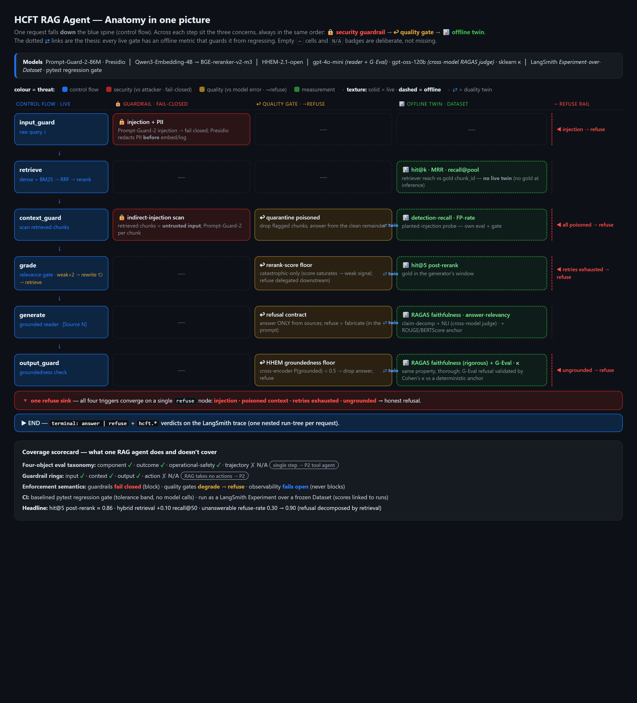

# HCFT Analyst Agent

A LangGraph agent system over ~6,000 public U.S. healthcare facility reports (519,555 chunks),
built as a **learning vehicle for production agent engineering**: LangGraph control flow, the
four-object evaluation taxonomy, enterprise guardrails, and full LangSmith tracing —
*with the theory behind each decision recorded alongside the code*.

It reuses only the **data layer** from the sibling **SLM_Fine_Tuning** (HCFT) project — the
Pinecone `hcft` vector index + the MongoDB `hcft.chunks` text store — and is otherwise a fresh
build. The generation ("reader") slot is swappable behind an OpenAI-compatible interface:
public frontier model now, the QLoRA fine-tuned `raft-3b-r64-v2_2` adapter later, compared in
the same slot on groundedness, refusal accuracy, latency, and cost.

## The agent in one picture



*One request falls down the control-flow spine (blue); across each step sit the three concerns in a
fixed order — **🔒 security guardrail** (vs attacker · fail-closed) → **↩ quality gate** (vs model
error · degrade-to-refuse) → **📊 offline eval twin** (dataset · measure-only). The dotted **⇄**
links are the thesis: every live gate has an offline metric guarding it from regressing. Empty `—`
cells and `N/A` badges are deliberate — they prove what's covered and what waits for the tool-using
agent (P2). [**Open the interactive version →**](docs/agent_anatomy.html)*

**Zoom in:** [pipeline map](docs/pipeline_map.html) — step × evaluation × guardrail detail ·
[guardrail rings](docs/guardrail_rings.html) — the defense-in-depth security model (input / context / action / output).

## Design principle: adopt the standard, own the decision

Every layer that has a mature industry tool **uses that tool** — no hand-rolled equivalents.
The custom code is the *design*: the graph topology, which metric maps to which step, the
domain span attributes, and the gate thresholds.

| Concern | Tool adopted | What we own |
|---|---|---|
| Observability | native **LangSmith** tracing (LangChain/LangGraph) | the `hcft.*` domain verdicts on each run |
| Component / outcome eval | **DeepEval**, **RAGAS** (faithfulness, answer-relevancy) | which metric binds to which node |
| Overlap reference metrics | `evaluate` / `torchmetrics` (ROUGE, BERTScore) | gold test-set curation |
| Custom verdicts (refusal/route) | **DeepEval G-Eval** | the metric definitions + thresholds |
| Output groundedness guard (live) | **Vectara HHEM-2.1-open** cross-encoder | refuse-vs-answer policy |
| Input + context guards (live) | **Meta Prompt-Guard-2-86M** (injection, incl. indirect) + **Presidio** (PII redaction) | fail-closed policy; quarantine-vs-refuse for poisoned chunks |
| Judge validation | **scikit-learn** Cohen's κ vs a deterministic anchor | the non-LLM anchor that breaks judge circularity |
| Retrieval | Pinecone (dense) + MongoDB `$text` (BM25), fused by **RRF** → **BGE-reranker-v2-m3** | the eval harness + gate calibration |

Observability **fails open** (no key → the app still runs); guardrails **fail closed**.

## What's built

### RAG chat agent (P1) — `src/hcft_agent/agents/rag_chat.py`
A self-correcting, fully-instrumented LangGraph state machine. **One span per node**, so each
step's eval and guard bind to its own span:

```
input_guard ─(injection)──────────────────────────────────► refuse ─► END
     │  (clean; PII redacted in-node · Presidio)                ▲ ▲ ▲
     ▼                                                          │ │ │
  retrieve ─► context_guard ─(all chunks poisoned)─────────────┘ │ │
     ▲              │  (quarantine poisoned chunks)                │ │
     │              ▼                                              │ │
     │           grade ─(relevant)─► generate ─► output_guard ─(grounded)─► END
     │              │  ─(weak, retries<2)─► rewrite ─► (loop)      │ │
     └──────────────┘  ─(retries exhausted)──────────────────────-┘ │
                                          (ungrounded) ──────────────┘
```

- **Three guardrail rings, all fail-closed**: input (Prompt-Guard-2 injection + Presidio PII
  redaction), **context** (indirect-injection scan on retrieved chunks — quarantine poisoned,
  refuse if all poisoned), output (HHEM groundedness). All **four** refusal triggers converge on
  one `refuse` node.
- **Deterministic gates** (no gold at inference): grade = rerank-score threshold (calibrated
  from data, not guessed); retry cap = 2 rewrites then refuse.
- **Inline groundedness guard** (HHEM) on the output ring — *refuse > fabricate*. All LLM-judge
  evaluation (RAGAS / DeepEval / G-Eval / κ) runs **offline**, never in the hot path.

> 📘 **New to the project? Read the [RAG Agent Tutorial](docs/RAG_AGENT_TUTORIAL.md)** — a full
> walk-through of the LangGraph design, retrieval, guardrails, and especially the **evaluation
> stack** (the four-object taxonomy, judge circularity, the refusal-by-retrieval decomposition),
> with an interview-style Q&A drill.

### Retrieval-quality baseline — `src/hcft_agent/eval/retrieval.py`
Standalone, deterministic harness judged off the gold `source_chunk_id` (no LLM, no
reranker-as-oracle → **no circularity**). Over 448 grounded questions:

| Metric | Pre-rerank | Post-rerank |
|---|---|---|
| recall@50 | **0.906** | — |
| hit@1 | 0.531 | **0.674** |
| hit@5 (context window) | 0.752 | **0.862** |
| MRR | 0.633 | **0.760** |

Headline **hit@5 POST-rerank = 0.862**. The read: retrieval leverage is upstream (9.4%
retriever miss) not the reranker (4.4% rerank miss). `--calibrate` dumps the gold-hit vs
unanswerable score distributions to set the grade-gate threshold empirically.

**Hybrid retrieval is now the default.** Adding a lexical (BM25) arm via MongoDB `$text` and
fusing with **Reciprocal Rank Fusion** catches exact terms (figures, acronyms) that dense
embeddings blur. Measured A/B (`scripts/retrieval_ab.py`, 120 grounded v3 questions):
recall@50 **0.70 → 0.80**, hit@5 exact **0.59 → 0.69** over dense-only.

### Evaluation stack — `src/hcft_agent/eval/`
The eval is layered by **trust**: deterministic anchors first (no circularity), LLM judges on
top, Cohen's **κ** validating the judges against a non-LLM anchor.

- **Deterministic** (`agent_eval.py`): retrieval hit@k; **refusal decomposed by retrieval** (you
  can't grade a refusal without knowing whether the answer was even retrieved — three regimes:
  answerable-in-context, retrieval-miss, unanswerable); ROUGE-L / BERTScore anchors.
- **LLM judges** (`judges.py`): **RAGAS** faithfulness (claim-decomposition + NLI) + answer-
  relevancy on a **cross-model** judge (`gpt-oss-120b` via Fireworks); **DeepEval G-Eval**
  refusal-correctness (gpt-4o-mini).
- **Judge validation** (`validate.py`): Cohen's **κ** of the G-Eval verdict vs the deterministic
  anchor — the real circularity-breaker.
- **Linked to runs**: `experiment.py` runs it as a **LangSmith `evaluate()` Experiment over a
  Dataset**, so every score attaches to the trace that produced it and successive agent versions
  are comparable example-by-example. `run_eval.py` is the offline twin (no network) that emits the
  identical report for the gate.
- **Regression gate** (`tests/test_eval_gate.py`, `tests/test_context_guard.py`): a baselined
  pytest gate fails any metric that regresses past a tolerance band — no model calls, just a JSON
  diff. The **scoreboard** (`scripts/build_eval_dashboard.py` → `docs/eval_scores.html`) renders
  every stage × substage with pass/fail vs baseline.

### Telemetry — `src/hcft_agent/obs/`
`telemetry.py` enables **native LangSmith tracing** (`LANGSMITH_TRACING`) and exposes
`trace_block()` (nest non-LangChain sub-steps) + `tag()` (attach `hcft.*` domain verdicts —
route, refusal, grounded, degraded — to each run). We started on OpenInference/OTel→OTLP but
reversed it: LangGraph's worker threads broke OTel's thread-local span context, orphaning every
node into its own root trace; LangChain's native tracer nests across those threads. Trade-off
(lost OTel vendor-neutrality) and the mechanism are recorded in [`SESSION_LOG.md`](docs/SESSION_LOG.md) §9a.

## Status

- [x] Telemetry: native LangSmith tracing — clean nested run trees (verified via the run tree)
- [x] Retrieval-quality harness + first real numbers (448 q; hit@5 post 0.862)
- [x] **Hybrid retrieval** (dense + BM25 + RRF) default — A/B +0.10 recall@50, +0.10 hit@5
- [x] **P1 RAG chat agent** — one span/node, deterministic gates, HHEM output guard, Streamlit UI
- [x] Grade-gate threshold calibration — rerank_score is a weak answer/refuse signal; refusal
      delegated to the output guard
- [x] **Eval stack**: DeepEval G-Eval + RAGAS (cross-model) + ROUGE/BERTScore + Cohen's κ +
      pytest regression gate + LangSmith Experiments + the scoreboard
- [x] **Guardrails**: input ring (Prompt-Guard-2 injection + Presidio PII redaction), **context
      ring** (indirect-injection scan, own eval + gate), output ring (HHEM)
- [x] **RAG Agent Tutorial** — full LangGraph + retrieval + guardrails + evaluation walk-through
- [ ] P2 tool-using analyst — trajectory eval + the action ring (allowlist / sandbox / HITL)
- [ ] P3 code-gen agent (sandboxed: AST allowlist + subprocess + HITL)
- [ ] raft-3b reader swap (merge → GGUF → Ollama) + same-slot comparison eval

## Repository layout

- `src/hcft_agent/`
  - `agents/` — the LangGraph agents (`rag_chat.py`, `state.py`)
  - `guards/` — `input_ring.py` (injection/PII), `context_ring.py` (indirect-injection scan on
    retrieved chunks), `injection.py` (Prompt-Guard-2), `pii.py` (Presidio), `groundedness.py` (HHEM)
  - `obs/` — `telemetry.py` (native LangSmith tracing + `trace_block()`/`tag()`)
  - `eval/` — `agent_eval.py` (deterministic), `judges.py` (RAGAS + G-Eval), `validate.py` (κ),
    `report.py` (scoreboard schema), `experiment.py` (LangSmith), `run_eval.py` (offline), `retrieval.py`
  - `retriever.py` (dense + BM25 + RRF + rerank), `generate.py` (grounded reader), `config.py` (settings)
- `tests/` — `test_eval_gate.py`, `test_context_guard.py` (the regression gates)
- `scripts/` — `retrieval_ab.py`, `eval_context_guard.py`, `build_eval_dashboard.py`, `filter_generic_qa.py`
- `docs/`
  - [`RAG_AGENT_TUTORIAL.md`](docs/RAG_AGENT_TUTORIAL.md) — **the full build + evaluation walk-through (start here)**
  - [`ARCHITECTURE.md`](docs/ARCHITECTURE.md) — graph topology, per-stage eval×guard×fallback, build plan
  - [`SESSION_LOG.md`](docs/SESSION_LOG.md) — the design record + measured results
  - [`CONCEPTS.md`](docs/CONCEPTS.md) — tracked glossary of every eval/safety/obs concept
  - [`V2_BACKLOG.md`](docs/V2_BACKLOG.md) — deferred Agent-1 polish (parked on purpose)
  - [`agent_anatomy.html`](docs/agent_anatomy.html) — **the one-picture master view (the README centerpiece)**
  - [`pipeline_map.html`](docs/pipeline_map.html) — the living step × evaluation × guardrail map (zoom-in)
  - **eval scoreboard** — every stage × substage with pass/fail vs baseline; generated by `scripts/build_eval_dashboard.py` (run an eval first)
  - [`guardrail_rings.html`](docs/guardrail_rings.html) — the defense-in-depth security model (input / context / action / output rings)

## Stack

| Component | Choice | Notes |
|---|---|---|
| Orchestration | LangGraph | explicit control flow; per-node spans for eval/guard binding |
| Observability | native LangSmith tracing | LangChain/LangGraph run trees; `trace_block()`/`tag()` for sub-steps |
| Vectors | Pinecone `hcft` (768-dim, cosine) | reused from HCFT; vectors only, no text |
| Rerank | BAAI/bge-reranker-v2-m3 | reused from HCFT stage 06 |
| Text + metadata | MongoDB 7 (Docker, `hcft-mongo` :27017) | replaces HCFT's sqlite text store |
| Groundedness guard | Vectara HHEM-2.1-open | live faithfulness proxy (~tens of ms, deterministic) |
| Reader (phase 1) | public model via OpenAI-compatible API | gpt-4o-mini / Fireworks |
| Reader (phase 2) | `raft-3b-r64-v2_2` merged + GGUF via Ollama | see lineage note below |

## Quickstart

```powershell
docker compose up -d                                          # MongoDB on 127.0.0.1:27017
pip install -e .                                              # editable install
python -m hcft_agent.eval.retrieval --limit 50                # retrieval sanity pass
python -m hcft_agent.agents.rag_chat "What infection control deficiencies were cited?"
```

Requires Pinecone credentials + a reader API key in `.env` (gitignored), and the chunk data
loaded into Mongo from the sibling `SLM_Fine_Tuning` repo.

## Reader model lineage (read before serving the fine-tune)

The reader adapter is **`raft-3b-r64-v2_2`** — QLoRA (4-bit NF4) on Llama-3.2-3B-Instruct,
trained in the HCFT repo (`src/04_train_qlora.py`, frozen 2026-06-02).

**rsLoRA conditionality — important for any merge math.** The HCFT trainer enables rsLoRA
*conditionally*: `config.yaml` sets `use_rslora: true`, but the code applies it **only at
rank ≥ 16** (`use_rslora = bool(cfg.lora.use_rslora and rank >= 16)`). Consequences:

- The deliverable r=64 adapter **was trained with rsLoRA**, i.e. update scale = α/√r = 16/√64
  = **2.0**, not the vanilla α/r = 16/64 = 0.25 — an **8× difference**.
- The r=8 ablation arm was vanilla LoRA, so the rank ablation is not a pure rank comparison
  across the r=8 ↔ r≥16 boundary (scaling scheme changes too).
- **When merging for GGUF/Ollama, use PEFT's `merge_and_unload()`**, which reads `use_rslora`
  from `adapter_config.json` and applies the correct scaling. Hand-rolled merge math that
  assumes α/r will under-scale the adapter by 8× and silently degrade the model.
- Verify after merge: same prompt template as training, and spot-check refusal behavior on
  known distractor questions before trusting the endpoint.

## Relationship to the HCFT (SLM_Fine_Tuning) project

This repo implements HCFT's designed fix for its known model-level refusal weakness — an
**external retrieval-confidence gate** (the grade + groundedness nodes here) — and the
designed-not-built "LangGraph graph" Phase-2 item. Serving via Ollama is a deliberate
divergence from the original vLLM LoRA hot-load plan (vLLM doesn't run natively on Windows);
the architecturally relevant property — an OpenAI-compatible boundary in front of the
fine-tune — is preserved. vLLM remains architected/cost-modeled, not operated.
