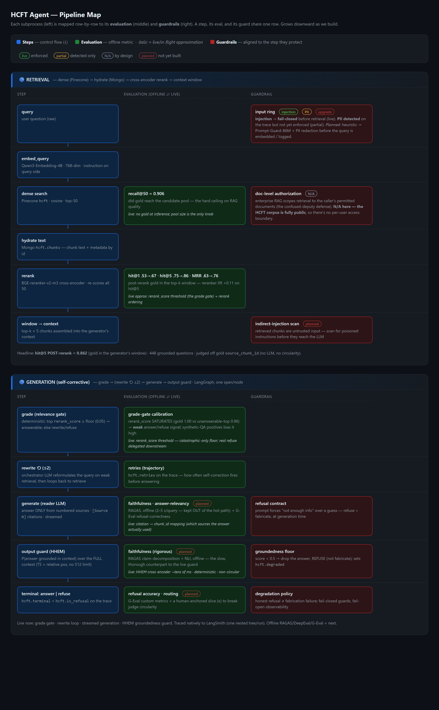

# HCFT Analyst Agent

A LangGraph agent system over ~6,000 public U.S. healthcare facility reports (519,555 chunks),
built as a **learning vehicle for production agent engineering**: LangGraph control flow, the
four-object evaluation taxonomy, enterprise guardrails, and full LangSmith tracing —
*with the theory behind each decision recorded alongside the code*.

It reuses only the **data layer** from the sibling **SLM_Fine_Tuning** (HCFT) project — the
Pinecone `hcft` vector index + the MongoDB `hcft.chunks` text store — and is otherwise a fresh
build. The generation ("reader") slot is swappable behind an OpenAI-compatible interface:
public frontier model now, the QLoRA fine-tuned `raft-3b-r64-v2_2` adapter later, compared in
the same slot on groundedness, refusal accuracy, latency, and cost.

## Pipeline map — every step × its evaluation × its guardrail



*The project at a glance. Each step (left) is mapped to its **evaluation** (middle — the offline
metric and its live, in-flight approximation) and its **guardrail** (right, aligned to the step it
protects). Two subprocesses today: **Retrieval** (dense → rerank → context window) and
self-corrective **Generation** (grade → rewrite ⟲ → generate → output guard). Everything shown is
live unless tagged `planned`. [**Open the interactive version →**](docs/pipeline_map.html)*

## Design principle: adopt the standard, own the decision

Every layer that has a mature industry tool **uses that tool** — no hand-rolled equivalents.
The custom code is the *design*: the graph topology, which metric maps to which step, the
domain span attributes, and the gate thresholds.

| Concern | Tool adopted | What we own |
|---|---|---|
| Observability | native **LangSmith** tracing (LangChain/LangGraph) | the `hcft.*` domain verdicts on each run |
| Component / outcome eval | **DeepEval**, **RAGAS** (faithfulness, answer-relevancy) | which metric binds to which node |
| Overlap reference metrics | `evaluate` / `torchmetrics` (ROUGE, BERTScore) | gold test-set curation |
| Custom verdicts (refusal/route) | **DeepEval G-Eval** | the metric definitions + thresholds |
| Output groundedness guard (live) | **Vectara HHEM-2.1-open** cross-encoder | refuse-vs-answer policy |
| Input guard (planned) | **Meta Prompt-Guard-86M** | fail-closed policy |
| Retrieval | Pinecone (dense) + **BGE-reranker-v2-m3** | the eval harness + gate calibration |

Observability **fails open** (no key → the app still runs); guardrails **fail closed**.

## What's built

### RAG chat agent (P1) — `src/hcft_agent/agents/rag_chat.py`
A self-correcting, fully-instrumented LangGraph state machine. **One span per node**, so each
step's eval and guard bind to its own span:

```
input_guard ─(injection?)─► refuse
     │
  retrieve ─► grade ─(relevant?)─► generate ─► output_guard ─(grounded?)─► END
     ▲              │                                          │
     │         (weak, retries<N)                          (ungrounded)
     └── rewrite ◄──┤                                          ▼
                 (exhausted) ───────────────────────────────► refuse
```

- **Deterministic gates** (no gold at inference): grade = rerank-score threshold (calibrated
  from data, not guessed); retry cap = N rewrites then refuse.
- **Inline groundedness guard** (HHEM) on the output ring only — *refuse > fabricate*. All
  LLM-judge evaluation (RAGAS / DeepEval / G-Eval) runs **offline**, never in the hot path.

### Retrieval-quality baseline — `src/hcft_agent/eval/retrieval.py`
Standalone, deterministic harness judged off the gold `source_chunk_id` (no LLM, no
reranker-as-oracle → **no circularity**). Over 448 grounded questions:

| Metric | Pre-rerank | Post-rerank |
|---|---|---|
| recall@50 | **0.906** | — |
| hit@1 | 0.531 | **0.674** |
| hit@5 (context window) | 0.752 | **0.862** |
| MRR | 0.633 | **0.760** |

Headline **hit@5 POST-rerank = 0.862**. The read: retrieval leverage is upstream (9.4%
retriever miss) not the reranker (4.4% rerank miss). `--calibrate` dumps the gold-hit vs
unanswerable score distributions to set the grade-gate threshold empirically.

### Telemetry — `src/hcft_agent/obs/`
`telemetry.py` enables **native LangSmith tracing** (`LANGSMITH_TRACING`) and exposes
`trace_block()` (nest non-LangChain sub-steps) + `tag()` (attach `hcft.*` domain verdicts —
route, refusal, grounded, degraded — to each run). We started on OpenInference/OTel→OTLP but
reversed it: LangGraph's worker threads broke OTel's thread-local span context, orphaning every
node into its own root trace; LangChain's native tracer nests across those threads. Trade-off
(lost OTel vendor-neutrality) and the mechanism are recorded in [`SESSION_LOG.md`](docs/SESSION_LOG.md) §9a.

## Status

- [x] Telemetry: native LangSmith tracing — clean nested run trees (verified via the run tree)
- [x] Retrieval-quality harness + first real numbers (448 q; hit@5 post 0.862)
- [x] **P1 RAG chat agent** — one span/node, deterministic gates, HHEM output guard, Streamlit UI
- [x] Grade-gate threshold calibration (`eval.retrieval --calibrate`) — found rerank_score is a
      weak answer/refuse signal; refusal delegated to the output guard
- [ ] Eval wiring: DeepEval + RAGAS + G-Eval custom metrics + pytest gate
- [ ] Input ring upgrade: heuristic → Prompt-Guard-86M
- [ ] P3 deep-analysis agent (MongoDB aggregation + map-reduce synthesis)
- [ ] P4 code-gen agent (sandboxed: AST allowlist + subprocess + HITL)
- [ ] raft-3b reader swap (merge → GGUF → Ollama) + same-slot comparison eval

## Repository layout

- `src/hcft_agent/`
  - `agents/` — the LangGraph agents (`rag_chat.py`, `state.py`)
  - `guards/` — `input_ring.py` (injection/PII), `groundedness.py` (HHEM output ring)
  - `obs/` — `telemetry.py` (native LangSmith tracing + `trace_block()`/`tag()`)
  - `eval/` — `retrieval.py` (deterministic retrieval harness + gate calibration)
  - `retriever.py` (dense + rerank), `generate.py` (grounded reader), `config.py` (settings)
- `docs/`
  - [`ARCHITECTURE.md`](docs/ARCHITECTURE.md) — graph topology, per-stage eval×guard×fallback, build plan
  - [`SESSION_LOG.md`](docs/SESSION_LOG.md) — the design record + measured results
  - [`CONCEPTS.md`](docs/CONCEPTS.md) — tracked glossary of every eval/safety/obs concept
  - [`pipeline_map.html`](docs/pipeline_map.html) — the living step × evaluation × guardrail map (the README image is a snapshot of this)
  - [`guardrail_rings.html`](docs/guardrail_rings.html) — the defense-in-depth security model (input / action / output rings)

## Stack

| Component | Choice | Notes |
|---|---|---|
| Orchestration | LangGraph | explicit control flow; per-node spans for eval/guard binding |
| Observability | native LangSmith tracing | LangChain/LangGraph run trees; `trace_block()`/`tag()` for sub-steps |
| Vectors | Pinecone `hcft` (768-dim, cosine) | reused from HCFT; vectors only, no text |
| Rerank | BAAI/bge-reranker-v2-m3 | reused from HCFT stage 06 |
| Text + metadata | MongoDB 7 (Docker, `hcft-mongo` :27017) | replaces HCFT's sqlite text store |
| Groundedness guard | Vectara HHEM-2.1-open | live faithfulness proxy (~tens of ms, deterministic) |
| Reader (phase 1) | public model via OpenAI-compatible API | gpt-4o-mini / Fireworks |
| Reader (phase 2) | `raft-3b-r64-v2_2` merged + GGUF via Ollama | see lineage note below |

## Quickstart

```powershell
docker compose up -d                                          # MongoDB on 127.0.0.1:27017
pip install -e .                                              # editable install
python -m hcft_agent.eval.retrieval --limit 50                # retrieval sanity pass
python -m hcft_agent.agents.rag_chat "What infection control deficiencies were cited?"
```

Requires Pinecone credentials + a reader API key in `.env` (gitignored), and the chunk data
loaded into Mongo from the sibling `SLM_Fine_Tuning` repo.

## Reader model lineage (read before serving the fine-tune)

The reader adapter is **`raft-3b-r64-v2_2`** — QLoRA (4-bit NF4) on Llama-3.2-3B-Instruct,
trained in the HCFT repo (`src/04_train_qlora.py`, frozen 2026-06-02).

**rsLoRA conditionality — important for any merge math.** The HCFT trainer enables rsLoRA
*conditionally*: `config.yaml` sets `use_rslora: true`, but the code applies it **only at
rank ≥ 16** (`use_rslora = bool(cfg.lora.use_rslora and rank >= 16)`). Consequences:

- The deliverable r=64 adapter **was trained with rsLoRA**, i.e. update scale = α/√r = 16/√64
  = **2.0**, not the vanilla α/r = 16/64 = 0.25 — an **8× difference**.
- The r=8 ablation arm was vanilla LoRA, so the rank ablation is not a pure rank comparison
  across the r=8 ↔ r≥16 boundary (scaling scheme changes too).
- **When merging for GGUF/Ollama, use PEFT's `merge_and_unload()`**, which reads `use_rslora`
  from `adapter_config.json` and applies the correct scaling. Hand-rolled merge math that
  assumes α/r will under-scale the adapter by 8× and silently degrade the model.
- Verify after merge: same prompt template as training, and spot-check refusal behavior on
  known distractor questions before trusting the endpoint.

## Relationship to the HCFT (SLM_Fine_Tuning) project

This repo implements HCFT's designed fix for its known model-level refusal weakness — an
**external retrieval-confidence gate** (the grade + groundedness nodes here) — and the
designed-not-built "LangGraph graph" Phase-2 item. Serving via Ollama is a deliberate
divergence from the original vLLM LoRA hot-load plan (vLLM doesn't run natively on Windows);
the architecturally relevant property — an OpenAI-compatible boundary in front of the
fine-tune — is preserved. vLLM remains architected/cost-modeled, not operated.
