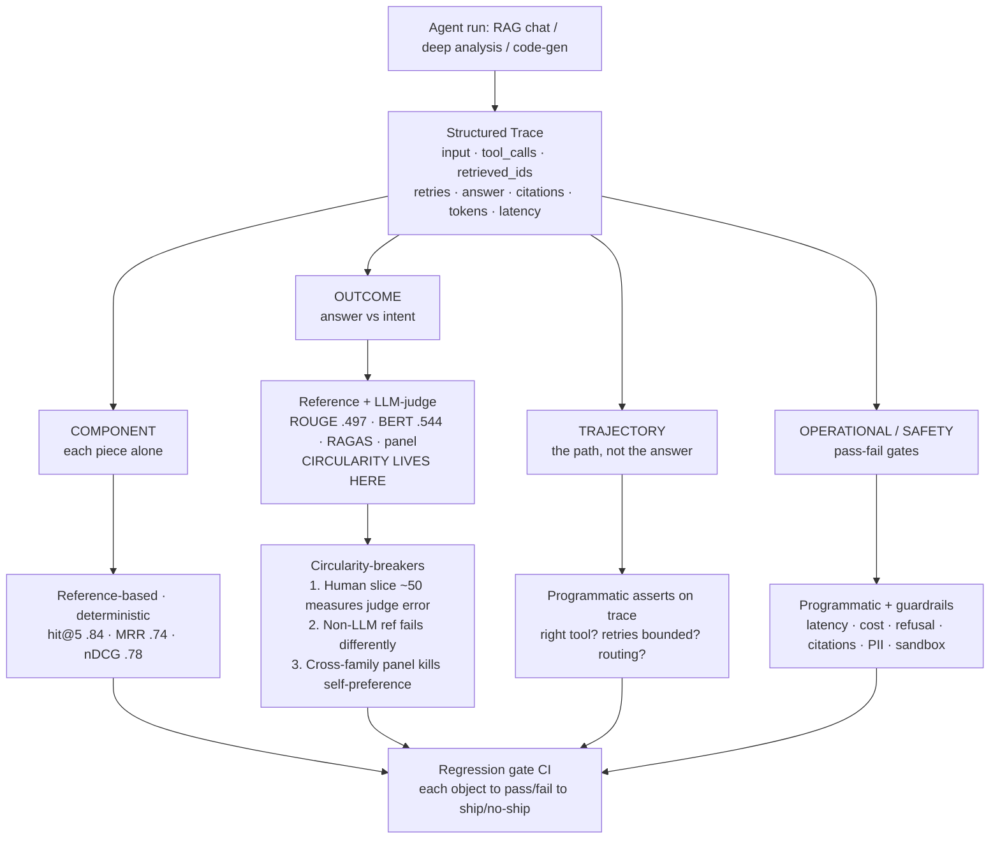

# HCFT Agentic Project — Session Log & Eval Architecture

> Portable record of the design conversation so it's available on any machine / tool
> after `git pull` (Cursor, Claude Code, web). Captures the project re-scope, the
> evaluation & safety theory covered, the architecture diagram, and the decisions
> (locked + open). Last updated: 2026-06-18.
>
> **Concept index:** [`CONCEPTS.md`](CONCEPTS.md) — the tracked glossary of every eval /
> validation / security / observability concept, with build status.
>
> **Architecture + plan:** [`ARCHITECTURE.md`](ARCHITECTURE.md) — graph topology, per-stage
> guards/eval, how the chat graph triggers the specialists, and the phased build tracker.

---

## 1. Project re-scope (decisions)

- **Goal:** use this project as a learning vehicle for LangGraph, agent performance /
  quality / safety evaluation, benchmarking, and the validation & guardrails enterprises
  use — *with the theory behind each*, not just the code.
- **Foundation:** fresh build, **reuse only the data layer** (Pinecone `hcft` index +
  Mongo `hcft.chunks` + the retrieval logic). Everything above that is built new.
- **Working model:** Claude implements; **the user is the architect on every technical
  decision, big and small.** Each fork is surfaced as
  `Decision → Options (with cost) → recommendation (+ why) → user's call`.
- **Three agents to build** (all scoped to the HCFT corpus):
  1. **RAG chat** — grounded Q&A with self-correction (grade → rewrite → regenerate) and
     clean refusal when the corpus can't answer.
  2. **Deep analysis** — Mongo aggregation agent + map-reduce multi-report synthesis.
  3. **Code-gen — full sandboxed coder** — NL→query + analysis + viz, with the enterprise
     story: capability scoping, AST allowlist, test-before-commit, subprocess sandbox.
- **Sequencing:** **eval / benchmarking / guardrails theory first**, so evaluability and
  guardrails are baked into the architecture from line one instead of bolted on.

---

## 2. The data layer (reused as-is)

- **Pinecone** index `hcft` — 768-dim, cosine, **vectors only** (cloud-hosted → reachable
  from any machine with the API key; nothing to port).
- **MongoDB** `hcft.chunks` — **519,555 docs** (chunk text + metadata). Local / dockerized
  (`hcft-mongo`). Portable via `mongodump --gzip --archive`.
- **Retriever:** Qwen3-Embedding-4B → Pinecone dense top-k=50 → Mongo hydrate →
  BGE-reranker-v2-m3 → top context (~5 sources).

### Verified HCFT eval numbers (source of truth = `mlflow.db` + project briefing)

| Model | ROUGE-L | BERTScore |
|---|---|---|
| Tuned 3B (RAG, `v2_2`) | **0.497** | **0.544** |
| gpt-4o-mini | 0.441 | 0.475 |
| stock Llama 3.2 3B | 0.365 | 0.359 |

- Retrieval after BGE rerank: **hit@1 0.66 · hit@5 0.84 · MRR 0.74 · nDCG@10 0.78**.
- **Caveat (load-bearing):** the 3B beats gpt-4o-mini **only on overlap metrics**; it
  **trails ~6 pts on the LLM judge**, and neutral-panel parity is proven for v1 only.
  Scope all claims to "overlap quality" — never "gpt-4o-mini-class judge."

---

## 3. The eval & safety stack (theory map)

Six layers, roughly in the order things must *exist*:

| # | Layer | Core question |
|---|---|---|
| 0 | **What you're evaluating** | Four distinct objects people conflate |
| 1 | **Methods** | Reference-based · reference-free/LLM-judge · human · programmatic asserts |
| 2 | **The LLM-judge problem** | Why it scales, why it's circular, what breaks the circularity |
| 3 | **Benchmarking** | Bespoke held-out sets, test-set construction, statistical rigor, regression gates |
| 4 | **Guardrails** | Input / output / **action** (the agent-specific hard part) |
| 5 | **Observability** | Tracing / spans / cost — the substrate that makes 0–3 possible |

---

## 4. Box 0 — the four objects of evaluation

Each needs a **different method** and a **different data shape**; all are computable from
**one structured trace per run**.

| Object | What | HCFT example | Method |
|---|---|---|---|
| **Component** | each piece in isolation | retrieval hit@5 0.84, reranker lift, reader@oracle | reference-based (deterministic) |
| **Outcome** | final answer vs intent | ROUGE-L 0.497, BERTScore 0.544, RAGAS, judge panel | reference + **LLM-judge** ← circularity |
| **Trajectory** | the *path*, not the answer | right tool? retries ≤ N? no rewriter-collapse? routed right? | **programmatic asserts on the trace** |
| **Operational / safety** | pass/fail gates | latency, cost, refusal acc, citation validity, PII, sandbox | programmatic + guardrail checks |

> A trajectory can be perfect with a wrong outcome (good process, bad luck) or a right
> outcome on a broken trajectory (lucky — fails tomorrow). Score them **separately**.

**Architecture consequence (locked):** every agent emits a structured trace
`{input, tool_calls, retrieved_ids, retries, answer, citations, tokens, latency}` from
line one. Bolt it on later → re-run everything.

---

## 5. Box 2 — the LLM-judge circularity problem (deep dive)

### Definition — it's *correlated error*
If the judge shares training data / model family / biases with the generator, the judge's
mistakes line up **in the same direction** as the generator's. The eval is structurally
blind to the failure modes they share. Degenerate case: same model generates and judges →
**self-preference** — the score measures "agreement with itself," not correctness.

### HCFT worked example
The synthetic QA was distilled from a **gpt-5 teacher** → GPT-flavored distribution. A
**GPT-family judge** would have *inflated* the 3B's score by rewarding inherited phrasing.
The honest signal exists *because* the project judged with a **neutral Gemma panel**. The
overlap metrics and the judge **disagree (~6 pts)** — and that disagreement is the honest
information.

### Bias catalog
| Bias | Effect | Mitigation |
|---|---|---|
| Self-preference | rates own/same-family higher | cross-family judge or panel |
| Position bias | favors answer A or B by slot | swap order, average; require consistency |
| Verbosity bias | prefers longer (toxic for grounded QA) | length control; penalize unsupported additions |
| Format/confidence | rewards confident tone, markdown | rubric anchored on substance |
| Sycophancy/anchoring | drifts toward hinted answer | don't leak the reference into the judge prompt |
| Non-determinism | same input → different score | sample N, report variance not a point |
| Low discrimination | clusters at 4/5 | atomic binary judgments, not holistic 1–5 |

### RAGAS — better conditioning, **not** an escape
Mechanism: decompose answer into atomic claims (LLM) → binary NLI "supported by retrieved
context?" per claim (LLM) → score = supported/total (deterministic arithmetic). Buys lower
variance + anchoring to a concrete artifact + arithmetic aggregation. **But every atomic
step is still an LLM judgment** — family self-preference and misreads still propagate.
RAGAS = a lower-variance, better-conditioned LLM judge, not non-LLM ground truth.

### What actually breaks circularity
1. **Human-anchored slice + agreement metrics** — label ~50–100 examples; score the *judge*
   against humans (κ, precision/recall). "Evaluate the evaluator" → quote the judge's own
   error rate. **The move that matters most.**
2. **Non-LLM reference metric** (ROUGE-L / BERTScore) — fails *differently* than the judge,
   so agreement = convergent validity, disagreement = localized failure.
3. **Judge diversity / panel** — 2–3 families, majority/variance; decorrelates
   self-preference.

> **Punchline:** you can't build a bias-free judge. The goal is to **measure, bound, and
> decorrelate** judge error so no two signals share the same blind spot, and the judge
> always carries a human-measured error bound.

---

## 6. Eval architecture diagram

```
┌──────────────────────────────────────────────────────────────────────────┐
│  AGENT RUN  (RAG chat │ deep analysis │ code-gen)                          │
│      └──►  emit ONE STRUCTURED TRACE   ◄── the line-one design decision     │
│           { input · tool_calls · retrieved_ids · retries ·                 │
│             answer · citations · tokens · latency }                        │
└───────────────────────────────────┬────────────────────────────────────────┘
                                     │   all four objects are computed from it
     ┌───────────────┬───────────────┼───────────────┬────────────────────┐
     ▼               ▼               ▼               ▼
┌───────────┐  ┌────────────────┐ ┌────────────┐ ┌────────────────────┐
│ COMPONENT │  │   OUTCOME      │ │ TRAJECTORY │ │ OPERATIONAL/SAFETY │
├───────────┤  ├────────────────┤ ├────────────┤ ├────────────────────┤
│ hit@5 .84 │  │ ROUGE-L  .497  │ │ right tool?│ │ latency · $tokens  │
│ MRR   .74 │  │ BERTScore .544 │ │ retries≤N? │ │ refusal accuracy   │
│ nDCG  .78 │  │ RAGAS faithful │ │ no rewriter│ │ citations valid?   │
│ reader @  │  │ judge panel    │ │  collapse? │ │ PII? sandbox held? │
│  oracle   │  │ (1–5 secondary)│ │ routed ok? │ │                    │
├───────────┤  ├────────────────┤ ├────────────┤ ├────────────────────┤
│ REFERENCE │  │ REFERENCE +    │ │ PROGRAMMATIC│ │ PROGRAMMATIC +     │
│ gold IDs  │  │ LLM-JUDGE      │ │ assert on   │ │ guardrail checks   │
│ ✓determ.  │  │ ◄ CIRCULARITY  │ │ the trace   │ │ ✓determ. pass/fail │
└───────────┘  └───────┬────────┘ └────────────┘ └────────────────────┘
                       │ the ONLY un-trustworthy-by-default method
        ┌──────────────┴───────────────────────────────────┐
        │  CIRCULARITY-BREAKERS  (put a bound on the judge) │
        │   1. Human slice ~50   → κ / precision-recall     │
        │   2. Non-LLM ref (ROUGE/BERT) → fails differently │
        │   3. Cross-family panel → kills self-preference   │
        └──────────────────────────┬────────────────────────┘
                                   ▼
        ┌───────────────────────────────────────────────────┐
        │  REGRESSION GATE (CI):  each object → pass/fail     │
        │  → ship / no-ship signal,  not a vanity dashboard  │
        └───────────────────────────────────────────────────┘
```



**Method trust ranking (raw):** reference-based (high, needs gold) · programmatic asserts
(high, most underused) · **LLM-judge (low until anchored)** · human (gold, expensive —
spend only on the ~50-slice).

---

## 7. Decisions — locked & open

**Locked**
- Four-object taxonomy is the spine of the eval harness.
- Structured trace emitted from line one (everything is computed from it).

**Recommended (pending user confirm)**
- Outcome-eval judge strategy: **cross-family 2-judge panel** + **RAGAS-decomposed
  faithfulness** as primary + **holistic 1–5 as coarse secondary** + a **~50-example
  human-anchor slice** baked in from day one.

**Open fork**
- Commit to the **~50-example human-anchor slice** (rigorous, JD-core, user's labeling
  effort later) vs. run judge-only (cheaper, but no measured error bound on the judge)?

**Locked (box 3, 2026-06-18)**
- **Benchmark = adopt + extend.** Curated HCFT set (448 grounded / 12 unanswerable) as v1;
  extend with agent-shaped trajectory/aggregate/refusal cases.
- **Human-anchor slice = 100 examples, binary** {grounded-correct / not}, stratified incl.
  hard/ambiguous + unanswerable. Yields each judge config's κ / precision-recall = the
  judge's measured error rate.
- **Regression gate = overlap + programmatic-trajectory + safety/refusal as HARD gates;
  judge DIRECTIONAL-only** (noisy + biased → never hard-blocks).

---

## 8. Box 3 — benchmarking (theory)

**Test set.** Public benchmarks (MMLU/HELM) measure general capability, not HCFT
faithfulness → need a bespoke held-out set. Hard parts: source-entity split hygiene (no
leakage), stratification (mirror corpus distribution), refusal-axis coverage (genuinely
unanswerable cases; current refusal acc 1/12), contamination control (judge never sees the
gold reference), and agent-shaped cases (routing/aggregate/code-gen, not just single-turn QA).

**Statistical rigor.** A point estimate without an interval isn't a result.
- Bootstrap per-example scores → CI on the mean (~±0.02–0.03 at n≈460).
- Paired significance between models (paired bootstrap / Wilcoxon for scores; McNemar for
  pass/fail) — the paired delta's CI must exclude zero.
- Judge non-determinism: run the judge N× on a slice, report variance; if variance ≈ the
  model gap, the judge can't distinguish them. (Why the overlap gap is real and the ~6-pt
  judge gap is within noise + biased.)

**Regression gate.** Gate on stable signals (deterministic); keep the judge directional.
Thresholds vs a frozen baseline + noise margin (block if ROUGE-L drops >1 CI below
baseline; if refusal accuracy regresses; if any trajectory assert fails). Runs in CI on
every prompt/graph/model change; red blocks merge.

### Programmatic trajectory asserts (the deterministic gate core)

"Trajectory" = the path the agent actually took (nodes/tools fired, order, args, retries,
retrieved IDs, termination). A *programmatic* assert is plain code reading the structured
trace and checking an invariant — no LLM, deterministic, cheap → ideal hard gate.

| Property | Assert over the trace | Catches |
|---|---|---|
| Grounding precondition | `retrieve` before `generate` | answering with no context |
| Bounded retries | `retries ≤ MAX_RETRIES` | runaway / expensive loops |
| No rewriter-collapse | consecutive queries differ | the known M2 bug |
| Routing correctness | aggregate Q → analysis agent (not RAG) | wrong-agent answers |
| Citation provenance | `cited_ids ⊆ retrieved_ids` | hallucinated citations |
| Refusal path | unanswerable Q → terminal node = `refuse` | fabrication on no-answer |
| Clean termination | hit `END`, not `recursion_limit` | silent runaway |
| Code-gen safety | generated code passed AST allowlist; ran only in sandbox | unsafe execution |

Outcome eval asks "was the answer good?" (fuzzy, needs judge/reference); trajectory eval
asks "did it follow the right procedure?" (structural, deterministic). A right answer via a
broken trajectory is a latent failure — trajectory asserts catch it before it bites.

---

## 9. Box 5 — observability tooling (decision 2026-06-18; **revised 2026-06-19 → LangSmith**)

**Chosen: LangSmith (hosted SaaS, paid).** Revised from Langfuse — user wants hands-on
experience with the reference tool and is paying for it. Tightest LangGraph integration
(automatic tracing via env vars, no infra to run); HCFT is public data so cloud egress is a
non-issue. The self-host-vs-hosted judgment remains the interview nuance: you'd reach for
self-hosted (Langfuse) under a data-residency constraint — exactly why Cisco built the
self-hosted Debugger Studio.

Principle (vendor-independent): the platform is the **capture / UI layer, NOT the eval.** We
still own the Pydantic **trace schema + gate** (the contract the programmatic asserts run
on); LangSmith adds the span tree, latency/cost waterfall, dataset/eval comparison UI, and
the annotation queue for labeling the 100-example anchor slice. **Having LangSmith ≠ having
evals** — measurement validity (gate thresholds, judge-circularity breakers, the human
anchor) stays our design.

Integration: set `LANGCHAIN_TRACING_V2=true` + `LANGCHAIN_API_KEY` + `LANGCHAIN_PROJECT`;
LangGraph traces automatically. Our trace schema stays the source of truth, mirrored to
LangSmith for inspection.

---

## 10. Box 4 — guardrails (theory + decisions, 2026-06-18)

**Reframe:** agentic security ≠ API security. The model is a non-deterministic actor that
consumes untrusted content AND holds capabilities → the threat is prompt injection steering
it into misusing legitimately-granted tools (confused deputy). **The retrieved HCFT corpus
is untrusted input** (indirect injection via a chunk).

Three rings:
- **Input** (pre-model): injection/jailbreak detection on user input AND retrieved chunks;
  scope enforcement; PII detection.
- **Output** (pre-user): groundedness gate (RAGAS-as-guardrail), citation enforcement
  (`cited_ids ⊆ retrieved_ids`), PII egress/toxicity, schema validation, refuse-not-fabricate.
- **Action** (agent-specific, code-gen spine): capability scoping (least privilege);
  NL→query safety (read-only, no `$where`/writes, cost-bounded); AST allowlist; sandboxed
  subprocess (no net, FS-restricted, mem/CPU/time caps); HITL approval + test-before-commit.

Cross-cutting: **defense in depth** (no single layer trusted) + the **eval/guardrail
duality** (same check = metric offline, gate online) → guardrail verdicts become trace
fields (`input_flags`, `output_grounded`, `action_allowed`, `sandbox_result`).

**Decisions (locked):**
- **Threat model = untrusted everything**, incl. retrieved docs → defend indirect prompt
  injection (detect on user input AND retrieved chunks).
- **Build = adopt tools (per ground rule 2026-06-19):** input ring = Llama Guard / Prompt
  Guard / NeMo / Guardrails AI; action ring = sandbox tool (E2B / Docker / RestrictedPython)
  + `bandit`/`ast` for AST checks + LangGraph `interrupt()` for HITL. (Supersedes the earlier
  "own the action ring" choice.)

---

## 11. Theory arc COMPLETE → build (library-first)

**Ground rule (2026-06-19):** no hand-rolled implementation where a standard tool exists —
own the *decisions*, adopt the *implementation*.

## 12. Build-vs-buy: NO custom AgentRunTrace (decided 2026-06-19)

Reasoned + web-verified. The "scattered run-data" worry (LangGraph state + LangSmith run +
DeepEval test case) is already solved by a standard, so the custom Pydantic trace is dropped.

**Revised stack:**
- **Run record** = **OpenInference / OTel GenAI semantic conventions** (auto-instrumented
  AGENT/LLM/RETRIEVER/TOOL spans + token/cost), plus our **`hcft.*` custom attributes** for
  domain verdicts (refusal/route/groundedness/degraded). Vendor-neutral; LangSmith ingests
  OTel → zero lock-in (swap to Phoenix/Langfuse by env var).
- **Eval + trajectory + gate** = **DeepEval** (`@observe` + LangGraph `CallbackHandler`,
  component & full-trace metrics incl. ToolCorrectness; pytest gate) + **RAGAS** +
  **`evaluate`/`torchmetrics`** (ROUGE/BERTScore) + **DeepEval G-Eval** (custom refusal/
  routing metrics).
- **Obs / labeling** = **LangSmith** via OTel ingest + annotation queues.
- **Action ring** = sandbox tool (E2B / Docker / RestrictedPython) + `bandit`/`ast`.

Custom code (allowed): the LangGraph agent graphs, thin glue + `hcft.*` attribute constants,
G-Eval metric definitions, and config (metrics/thresholds per agent).

Sources: OTel GenAI agent spans · OpenInference · DeepEval component-level eval + LangGraph
integration · LangSmith OpenTelemetry support.

### Build sequence (P0 skeleton)
1. Deps + repo restructure (move old m1/m2/m3 → `reference/`).
2. **Telemetry**: OpenInference instrumentation + OTel→LangSmith exporter (env-driven) +
   `hcft.*` attribute-constants module.
3. **Eval wiring**: DeepEval CallbackHandler + RAGAS + G-Eval custom metrics + threshold
   config (the gate).
4. First agent (**RAG chat**) instrumented end-to-end → first real numbers.
